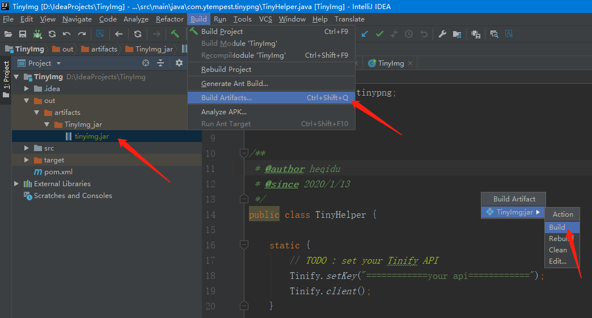

# TinyPNG

TinyPNG 是一个在线压缩 PNG 或 JPEG 格式图片的工具，同时压缩质量比较好。

TinyPNG 官网地址：[https://tinypng.com/](https://tinypng.com/)

附上一张官网的截图：


<br/>

## 前言

当时写这个脚本的原因主要是网上很多的 TinyPNG 的脚本都是用 Python 写，使用时需要 Python 的环境以及安装 tinify 包，太多麻烦，然后看到 TinyPNG 官网有 Java 的 API 接口，就决定自己动手写一个 jar 封装这些麻烦，只需一个 jar 就能实现图片压缩。

<br/>

## 准备工作

**一、**  到 TinyPNG 申请 `API_KEY`，注意：每个 `API_KEY` 每个月只能压缩 500 张图片，当然你用多个邮箱申请多个 `API_KEY`，每次压缩的图片大小不能超过 5 M。[申请传送门](https://tinypng.com/)

**二、**  拉取 TinyImg 工程，并用 IDEA 打开，定位到 `TinyHelper.java` 类
将 `============your api============` 替换你的 `API_KEY`，如下：

```
static {
    // TODO : set your Tinify API
    Tinify.setKey("============your api============");
    Tinify.client();
}
```

**三、**  菜单栏选择 Build -> Build Artifacts -> TinyImg.jar -> Build，生成的 tinyimg.jar 就可以直接用了，如下：



<br/>

**如果想偷懒可以试试下面的方法：**

1. 直接下载已经构建好的  [tinyimg.jar](tinyimg.jar)  文件
2. 以压缩文件的方式打开，注意不要解压！！！找到里面的  `com/ytempest/tinyimg/TinyHelper.class` 文件，将这个文件解压出来
3. 用 notepad++ 打开这个 `class` 文件【其他编辑器也可以，只要编码格式是 `ANSI` 就可以】，
搜索`============your-api============`，将其替换成你的 `API_KEY` 后保存
4. 将 [tinyimg.jar](tinyimg.jar) 文件中原来的 `TinyHelper.class` 文件替换成我们修改后的 `TinyHelper.class` 文件，这样就可以直接使用了！！！

猜测：Java 源文件编译成 `class` 文件时字符串资源是不会被修改的，只是编码格式改变了，需要注意的是通过这种方式修改的字符串长度必须和源文件的字符串长度保持一致，否则会破坏 `class` 文件的运行

<br/>

## 使用方法

### 一、环境

确保 JDK 环境，没有请自行安装配置

<br/>

### 二、使用说明

1、压缩单个图片文件：

示例：`java -jar tinyimg.jar inputImgPath outputImgPath`

说明：

- `inputImgPath `：需要压缩的图像文件路径

- `outputImgPath`：压缩后的图像输出路径【可选，不设置默认覆盖原文件】

<br/>

2、压缩文件夹下的图片文件：

示例1：`java -jar tinyimg.jar`

说明：

- 默认压缩当前目录下的图片文件，并覆盖原文件；
- 如果你想压缩当前目录下的图片文件，并输出到指定目录，你可以用：
  `java -jar tinyimg.jar . outputDirPath`

<br/>

示例2：`java -jar tinyimg.jar inputDirPath outputDirPath`

说明：

- `inputDirPath  `：需要压缩的图像文件夹

- `outputDirPath`：压缩后的图像输出文件夹【可选，不设置默认覆盖原文件】


