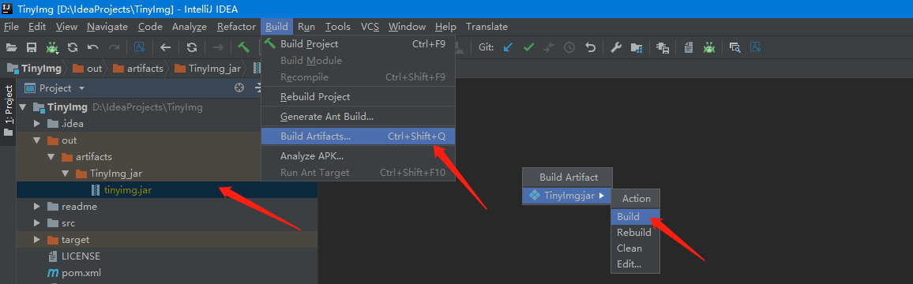

[](README_ZH.md)


# TinyPNG Introduction

Tiny PNG is a tools of  compressed PNG or JPEG image online , also that quality  of compression is better

Official website of TinyPNG：[https://tinypng.com/](https://tinypng.com/)

Attach a screenshot of the official website：


<br/>

## Foreword

The main reason for writing this script at that time was that many scripts of TinyPNG on the Internet were written in Python,  which required Python environment and install tinify package.  It was too troublesome. Then, I found that official website of TinyPNG had provide Java API ,  so I decided to write a jar to encapsulate these troubles to use a jar can be realize image compression.

<br/>

## Preparation

**Fisrt,** apply an  `API_KEY` in [TinyPNG](https://tinypng.com/). Note:  Each `API_KEY` only can be compress 500 images every month. Of course,  you can apply more `API_KEY` in multiple mailboxes.  Then the size of each compressed image can't be more then 5 M.

**Second,** Pull the TinyImg prject and open it use IDEA，find the `TinyHelper.java` .<br/>
Replace `============your api============` to your `API_KEY`，as follows：

```
static {
    // TODO : set your Tinify API
    Tinify.setKey("============your api============");
    Tinify.client();
}
```

**Third,** select in menu bar : Build -> Build Artifacts -> TinyImg.jar -> Build, the jar can be use directly after generate,  as follows:



<br/>

**Want to simple? You can try  the way** 

1. Dowload the [tinyimg.jar](https://raw.githubusercontent.com/ytempest/TinyImg/master/tinyimg.jar) file had build successfully
2. Open it as zip file, but didn't unzip!  find the file `com/ytempest/tinyimg/TinyHelper.class` inside,  and unzip this file.
3. Open thd `class` file in noptepadd++ [Other edtior also can as long as its encoding format is `ANSI` ]. <br/>Search `============your-api============` in file and replace it to your `API_KEY` and save.
4. Replace the original  `TinyHelper.class`  in [tinyimg.jar](https://raw.githubusercontent.com/ytempest/TinyImg/master/tinyimg.jar) to a new `TinyHelper.class` modify by us. Congratulation,  you can use it now.

Guess: When the Java source file is compiled into a `class` file,  the string resource will not be modified,  but the encoding format has changed.  Note that the string length modified in this way must be consistent with the string length of the source file, otherwise the operation of the `class` file will be damaged

<br/>

## Usage

### 1. Environment

Please ensure JDK Environment,  setup it if didn''t had.

<br/>

### 2. How use

1、Compress single image file：

Example：`java -jar tinyimg.jar inputImgPath outputImgPath`

Explain：

- `inputImgPath `：The path of image need compress

- `outputImgPath`：Output path of image compress finish. [Selectable,  default override original file if not set ]

<br/>

2、Compress image file under directory：

Example One ：`java -jar tinyimg.jar`

Explain：

- Compress the image file under current directory and override original imagefile
- If you want to compress the image file under current directory and ouput to target directory.  you can use : `java -jar tinyimg.jar . outputDirPath`

<br/>

Example Two：`java -jar tinyimg.jar inputDirPath outputDirPath`

Explain：

- `inputDirPath  `：The directory that include the image file need to compress

- `outputDirPath`：The path of output after compress finish. [Selectable,  default override if not set]


